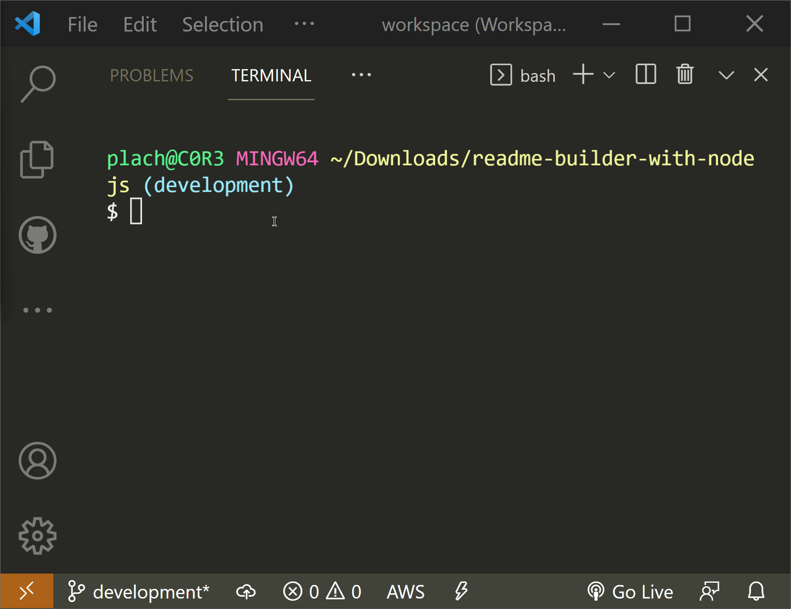

# A Professional README Generator with Node.js

## Description

Using Node.js to build a professional README.md dynamically based on user input.
> Lets you quickly and easily generate a README file by using a node via the command-line. This allows the developers to quickly generated uniform READMEs for all projects.

## Index

- [Useage](#useage)
    - [Requirements](#requirements)
    - [Installation](#installation)
    - [Using The App](#using-the-app)
    - [Starting the App](#starting-the-app)
    - [Viewing Results](#viewing-results)
    - [Repo Stats](#repo-stats)

- [Contributors](#contributors)
- [Questions?](#questions)

## Usage

> Below I've broken down app requirements, how to install, start, use, and then view the results of this app.

- For your convience, here is a [full video of running the app](./assets/images/useapp.mp4)

### Requirements

- [Node.js](https://nodejs.org/en/)
- [Inquierer.js](https://www.npmjs.com/package/inquirer)

### Installation

> This app is designed to be ran locally. That means you'll need to download the repo.

### Starting The App

<!--  -->

### Using the App

<!--  -->

### Viewing Results

<!--  -->

## Repo Stats

## Contributors

### [Erik Plachta](https://github.com/ErikPlachta)

- Reviewed concept, and re-built from the ground up.

### [Xandromus](https://github.com/Xandromus)

- Built the concept of the project.

## Questions?

> Feel free to contact me on my twitter  @ErikPlachta